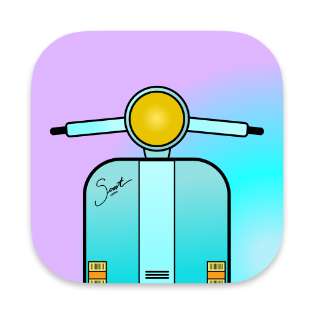

# Scoot

_Meet **Scoot**, your friendly cursor teleportation and actuation tool._

---

Scoot is a tiny utility app that provides fast, keyboard-driven control over the mouse pointer. Scoot lets you move your mouse—and click and drag, too—all from the comfort of your keyboard!

---

## About

* Scoot is experimental. Is it possible to craft a keyboard-driven mouse movement utility that's _actually_ efficient? Something that you'll actually _want_ to use? This is going to take some trial and error.

* Scoot is in the early proof of concept + prototyping stage.

* Scoot runs on MacOS, versions 10.15 (Catalina) and 11 (Big Sur).

* Scoot is an AppKit app, written in Swift.

* Scoot complements mouse-related accessibility tools that ship as part of MacOS, such as [Mouse Keys][mouse-keys] and other [accessibility shortcuts][mac-accessibility-shortcuts].

## Usage

To activate Scoot, use the ⇧⌘J global keyboard shortcut. (As long as Scoot is running, this hotkey will bring the app to the foreground.)

When Scoot is in the foreground, use ⌘G to toggle the grid on/off.

You can jump directly to a cell in the grid. Each cell is marked with a label (e.g. “aaa”, “aas”, “aad”); type the characters, one letter at a time, and, as soon as a complete sequence is entered, the mouse cursor will move directly to the center of the corresponding cell. (This approach, including the use of a char-based decision tree, is heavily inspired by [avy][avy].)

If you make a mistake while entering a label, hit the escape key (or C-G) to cancel and start over.

Scoot _also_ supports cursor movement via standard Mac keyboard shorcuts for [moving the insertion point][mac-keyboard-shortcuts-text]. (This means that keyboard shortcuts intended for navigating around in a document have been re-purposed to control movement on a 2-dimensional grid. Some liberties have been taken with this mapping; hopefully you find these keybindings intuitive.)

The equivalent standard Emacs keybindings should also work out-of-the-box, if you have them configured system-wide (for example, via [Karabiner-Elements][karabiner-elements] [[complex modification][karabiner-elements-emacs-mod]], or by augmenting the [system defaults][emacs-keyboard-shortcuts-osx] [[DefaultKeyBinding.dict][defaultkeybinding.dict], [Cocoa Text System][cocoa-text-system], [Text System Defaults and Key Bindings][apple-dev-text-system]]).

### Keybindings

_Not sure what these symbols mean? See the [symbol reference][what-are-those-mac-symbols], and [Emacs key notation][emacs-key-notation]._

#### Movement

| System | Emacs | Description                                                 |
|--------|-------|-------------------------------------------------------------|
| ↑      | C-p   | Move cursor up (partial step)                               |
| ↓      | C-n   | Move cursor down (partial step)                             |
| ←      | C-b   | Move cursor left (partial step)                             |
| →      | C-f   | Move cursor right (partial step)                            |
| ⌥↑     | M-a   | Move cursor up (full step)                                  |
| ⌥↓     | M-e   | Move cursor down (full step)                                |
| ⌥←     | M-b   | Move cursor left (full step)                                |
| ⌥→     | M-f   | Move cursor right (full step)                               |
| ⌘↑     | M-<   | Move cursor to top edge of screen                           |
| ⌘↓     | M->   | Move cursor to bottom edge of screen                        |
| ⌘←     | C-a   | Move cursor to left edge of screen                          |
| ⌘→     | C-e   | Move cursor to right edge of screen                         |
| ⌃L     | C-l   | Move cursor to center, and (on repeat) cycle around corners |

#### Other

| Shortcut | Description                        |
|----------|------------------------------------|
| ⌘G       | Toggle grid display                |
| ⌘C       | Click (at current cursor location) |

## Installation

Pre-built binaries are not (yet) available. To build, you'll need Xcode 12.5 (or later); `open Scoot.xcodeproj` and select _Product_ → _Build_.

## Backlog

- Ability to specify destination when dragging.
- Menu bar item.
- Ability to record, save, and run macros.
- Multi-monitor support.
- Enable global keyboard shortcuts to be overridden.
- Enable non-global keyboard shortcuts to customized.
- Enable grid colours, opacity, etc. to be customized.
- Show visual feedback when walking the decision tree.
  - After starting a sequence, indicate which keys can still be pressed.
  - If user types an invalid key, let them know. (Avy handles this by writing _"no such candidate ..." to the minibuffer; see [here](https://github.com/abo-abo/avy/blob/e92cb37457b43336b765630dbfbea8ba4be601fa/avy.el#L474-L475).)

## License

Scoot is released under the terms of the [BSD 3-Clause License](LICENSE).

Copyright (c) 2021, [Michael Russo](https://mjrusso.com).

[avy]: https://github.com/abo-abo/avy
[mouse-keys]: https://support.apple.com/en-ca/guide/mac-help/mh27469/mac
[mac-accessibility-shortcuts]: https://support.apple.com/en-ca/HT204434
[mac-keyboard-shortcuts]: https://support.apple.com/en-ca/HT201236
[mac-keyboard-shortcuts-text]: https://support.apple.com/en-ca/HT201236#text
[what-are-those-mac-symbols]: https://support.apple.com/en-ca/guide/mac-help/cpmh0011/mac
[emacs-key-notation]: https://www.emacswiki.org/emacs/EmacsKeyNotation
[karabiner-elements]: https://karabiner-elements.pqrs.org
[karabiner-elements-emacs-mod]: https://ke-complex-modifications.pqrs.org/#emacs_key_bindings
[emacs-keyboard-shortcuts-osx]: https://jblevins.org/log/kbd
[defaultkeybinding.dict]: https://github.com/nileshk/mac-configuration/blob/99eef47cd434fd3d6f4f1f9e2f50321f32179b88/Library/KeyBindings/DefaultKeyBinding.dict
[cocoa-text-system]: https://www.hcs.harvard.edu/~jrus/site/cocoa-text.html
[apple-dev-text-system]: https://developer.apple.com/library/archive/documentation/Cocoa/Conceptual/EventOverview/TextDefaultsBindings/TextDefaultsBindings.html
