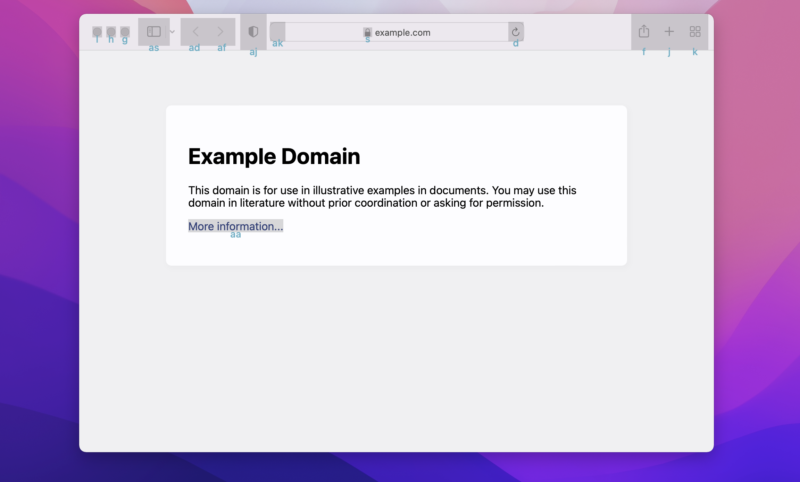
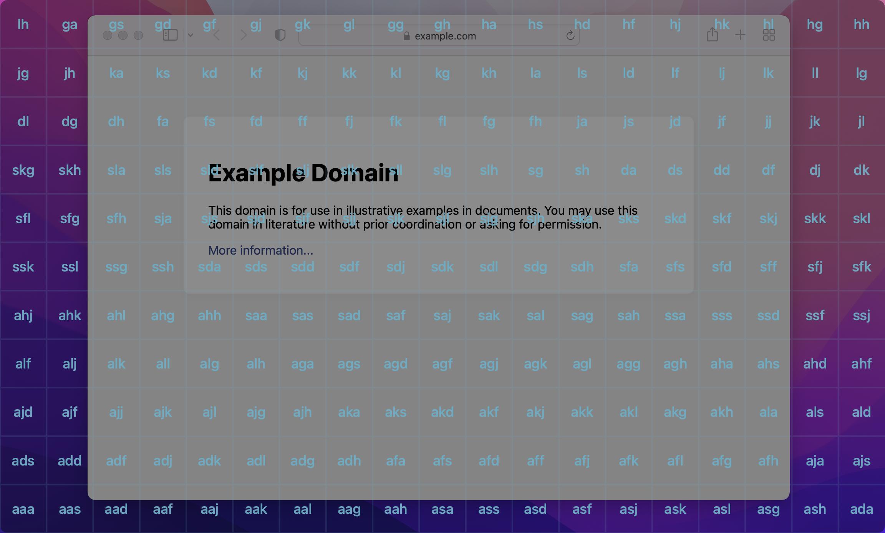
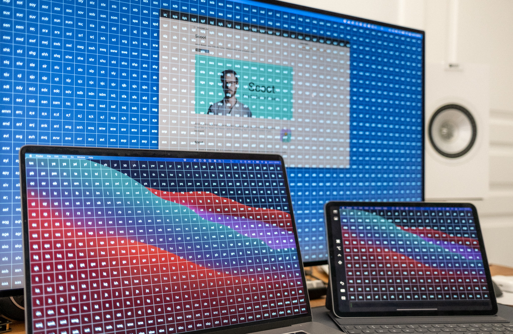
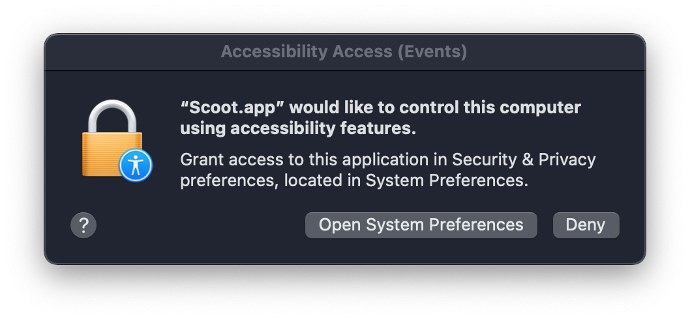
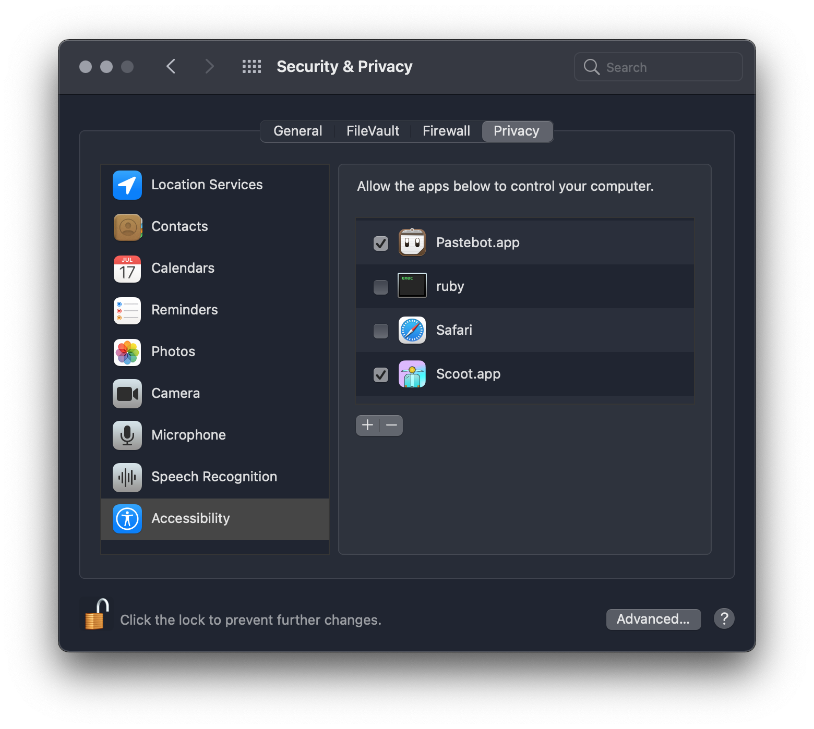
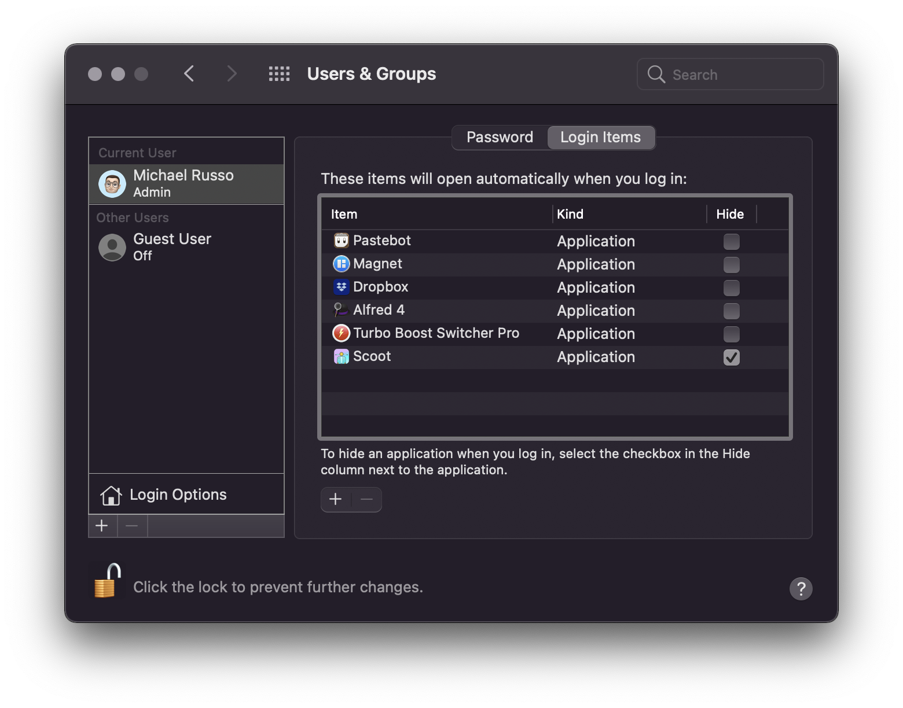

# Scoot

_Meet **Scoot**, your friendly cursor teleportation and actuation tool._

Scoot helps you efficiently move your mouse cursor, using keyboard shortcuts!

For updates, [follow @mjrusso on Twitter](https://twitter.com/mjrusso).

</a>

<p align="center">
  
</p>

---


Scoot is a tiny utility app that provides fast, keyboard-driven control over the mouse pointer. Scoot lets you move your mouse—and click and drag, too—all from the comfort of your keyboard.

Scoot supports two primary navigation modes: **element-based**, and **grid-based**.

* **Element-based navigation:** MacOS accessibility APIs are used to find user interface elements, such as buttons and links, on the user's screen. (In this mode, Scoot will look for elements in the focused window of the frontmost app.) Here, for example, Scoot has identified the only link on the page _("More information...")_, and assigned it the key sequence "aa":

<p align="center">
  
</p>

* **Grid-based navigation:** all connected screens are subdivided into a grid of equally-sized cells.

<p align="center">
  
</p>

Each location is identified by a unique character sequence, making each element (or cell) uniquely addressable with the keyboard — simply type the associated key sequence to teleport your mouse cursor to that location.

Scoot also supports moving the mouse cursor using text editing keyboard shortcuts that you're likely already familiar with (specifically, those for moving the insertion point). Scoot supports standard MacOS text editing shortcuts, as well as Emacs and vi keybindings. For a full breakdown, see the [usage documentation](#usage).

There's also a supplementary usage mode:

* **Freestyle:** a freeform usage mode that offers no special navigation assistance. It's like using the grid-based navigation mode, but _without_ bringing up the grid.

Freestyle mode is particularly handy for those cases where you want to quickly nudge the cursor using the (re-purposed) text editing keyboard shortcuts, and would prefer to not have the grid or element-based views on screen.

## About

* Scoot is experimental. Is it possible to craft a keyboard-driven mouse movement utility that's _actually_ efficient? Something that you'll actually _want_ to use? This is going to take some trial and error.

* Scoot is in the early proof of concept + prototyping stage.

* Scoot runs on MacOS 11 (Big Sur), and 12 (Monterey).

* Scoot is an AppKit app, written in Swift. (There's still some Carbon in here, too! [Yes][carbon-events], [really][carbon-accessibility].)

* Scoot complements mouse-related accessibility tools that ship as part of MacOS, such as [Mouse Keys][mouse-keys] and other [accessibility shortcuts][mac-accessibility-shortcuts], in addition to mouse emulation provided via keyboard firmware ([QMK][qmk-mouse-keys], for example).

## Usage

To activate Scoot in the **element-based navigation mode**, use the ⇧⌘J global keyboard shortcut. Alternatively, to activate Scoot in the **grid-based navigation mode**, use the ⇧⌘K global keyboard shortcut. And for **freestyle mode**, use the ⇧⌘L global keyboard shortcut.

(As long as Scoot is running, any of these hotkeys will bring the app to the foreground, and activate the requested mode.)

When Scoot is in the foreground:

* You can jump directly to a cell (a UI element, or a location in the grid, depending on the active navigation mode). Each cell is marked with a label (e.g. “aaa”, “aas”, “aad”); type the characters, one letter at a time, and, as soon as a complete sequence is entered, the mouse cursor will move directly to the center of the corresponding cell. (This approach, including the use of a char-based decision tree, is heavily inspired by [avy][avy].)
  * If you make a mistake while entering a label, hit the escape key (⎋) to cancel and start over. (Alternatively, you can type ⌘. or C-G.)
  * This feature is not available in freestyle mode, which does not present any special UI, or otherwise offer any navigation assistance via a char-based decision tree.

* You can _also_ move the cursor via the standard Mac keyboard shortcuts for [moving the insertion point][mac-keyboard-shortcuts-text]. (This means that keyboard shortcuts intended for navigating around in a document have been re-purposed to control movement on a 2-dimensional grid. Some liberties have been taken with this mapping; hopefully you find these keybindings intuitive.) This feature works in _all_ modes (element-based, grid-based, and freestyle).
    * The equivalent standard Emacs keybindings should also work out-of-the-box, if you have them configured system-wide (for example, via [Karabiner-Elements][karabiner-elements] [[complex modification][karabiner-elements-emacs-mod]], or by augmenting the [system defaults][emacs-keyboard-shortcuts-osx] [[DefaultKeyBinding.dict][defaultkeybinding.dict], [Cocoa Text System][cocoa-text-system], [Text System Defaults and Key Bindings][apple-dev-text-system]]).
    * The equivalent vi bindings are also (optionally) available; see [keybindings](#keybindings) for details.

* You can click with the left mouse button (at the current cursor location) by hitting the Return (↵) key.

* You can hold the left mouse button down by hitting ⌘↵. (To release the button, type ⌘↵ again, or, alternatively, just press ↵ on its own.)
  * To perform a drag-and-drop operation: situate the cursor above the object you want to drag and press ⌘↵, then move the mouse cursor to the desired drag destination (using one or more of the mechanisms that Scoot makes available), and then press ⌘↵ again to perform the drop.

* You can double-click with the left mouse button (at the current cursor location) by hitting the Shift and Return keys together (⇧↵).

* You can scroll, by pressing the Shift key in conjunction with the arrow key (↑, ↓, ←, →) pointing in the desired scroll direction.

After clicking, any overlaid UI elements (such as the element view, or the grid) will automatically hide. You can also hide these UI elements (and send Scoot to the background) at any time by pressing ⌘H.

Scoot includes a menu bar icon (an illustration of a Vespa-inspired scooter).


* When Scoot is not active (i.e., running in the background), the icon will render in an outlined mode.
* When Scoot is in the foreground, the icon will render with a fill (see screenshot), to make it clearer that Scoot is currently active. (This shouldn't generally be a concern, but it is especially handy when you're in freestyle mode.)
* Additional options are exposed when clicking on the menu bar icon, including a _help_ menu item — which currently opens this README in the user's default browser.

Scoot is fully compatible with Spaces (and can be used in conjunction with apps that are running in native fullscreen mode).

Scoot also works on systems with multiple connected displays.

<p align="center">
  
</p>

_If you use multiple displays, and experience an issue with Scoot's windows drawing in an incorrect location when the app launches (e.g. all Scoot windows appearing on the same display), please post your findings [in this issue](https://github.com/mjrusso/scoot/issues/18), and note the value of your “Displays have separate Spaces” checkbox in Mission Control._ If you do happen to find yourself in this state, you should be able to fix the window arrangement by clicking Scoot's menu bar icon, then “Debug”, and finally “Rebuild Jump Windows”.

### Keybindings

_Not sure what these symbols mean? See the [symbol reference][what-are-those-mac-symbols], and [Emacs key notation][emacs-key-notation]._

Note that vi keybindings are not enabled by default, and must be explicitly toggled on (documentation: [how to turn on vi keybindings](#activating-vi-keybindings)). Emacs keybindings (and most system keybindings) are disabled when vi keybindings are active.

| Shortcut  | Alternate | Description                                                                                                       |
|-----------|-----------|-------------------------------------------------------------------------------------------------------------------|
| ⇧⌘J       |           | Use element-based navigation (bring Scoot to foreground)                                                          |
| ⇧⌘K       |           | Use grid-based navigation (bring Scoot to foreground)                                                             |
| ⇧⌘L       |           | Use freestyle mode (bring Scoot to foreground)                                                                    |
| ⌘H        |           | Hide UI (bring Scoot to background)                                                                               |
| ⎋ (or ⌘.) | C-g       | Cancel: if currently typing a label, clears all currently-typed characters; otherwise, brings Scoot to background |

_Note:_ ⎋ signifies the Escape key.

#### Cursor Movement

| System | Emacs | vi  | Description                                                 |
|--------|-------|-----|-------------------------------------------------------------|
| ↑      | C-p   | k   | Move cursor up (partial step)                               |
| ↓      | C-n   | j   | Move cursor down (partial step)                             |
| ←      | C-b   | h   | Move cursor left (partial step)                             |
| →      | C-f   | l   | Move cursor right (partial step)                            |
| ⌥↑     | M-a   | C-k | Move cursor up (full step)                                  |
| ⌥↓     | M-e   | C-j | Move cursor down (full step)                                |
| ⌥←     | M-b   | C-h | Move cursor left (full step)                                |
| ⌥→     | M-f   | C-l | Move cursor right (full step)                               |
| ⌘↑     | M-<   | ⇧-k | Move cursor to top edge of screen                           |
| ⌘↓     | M->   | ⇧-j | Move cursor to bottom edge of screen                        |
| ⌘←     | C-a   | ⇧-h | Move cursor to left edge of screen                          |
| ⌘→     | C-e   | ⇧-l | Move cursor to right edge of screen                         |
| ⌃L     | C-l   | ⇧-m | Move cursor to center, and (on repeat) cycle around corners |

#### Clicking

| Shortcut | Description                                                            |
|----------|------------------------------------------------------------------------|
| ↵        | Click left mouse button (at current cursor location)                   |
| =        | Press and hold left mouse button (once activated, type `↵` to release) |
| \        | Double-click left mouse button (at current cursor location)            |
| [        | Click middle mouse button (at current cursor location)                 |
| ]        | Click right mouse button (at current cursor location)                  |

Scoot will pass along any pressed modifier keys when simulating clicks. This means that Command-click, Option-click, Control-click, and Shift-click are all supported (or any combination thereof). For example, ⌘↵ will Command-click the left mouse button at the current cursor location, ⌥↵ will Option-click, ⌃↵ will Control-click, ⇧↵ will Shift-click, etc.

Scoot can't take control of the mouse cursor when a context menu is active (for example, after right clicking). However, system-provided keyboard shortcuts for selecting the item in a menu (such as ↑, ↓, ←, →, C-n, C-p, ↵) will work as expected.

For simplicity, Scoot only supports simulating holding/ dragging, and double clicking, with the left mouse button. (If you have a use case that requires more exotic click handling, please [file an issue][scoot-issues] with details.)

_Note:_ ↵ signifies the Return (a.k.a Enter) key. _(Sidenote: technically, Return and Enter are [two different keys][return-and-enter-are-two-different-keys].)_

#### Scrolling

| System | Emacs | vi  | Description                               |
|--------|-------|-----|-------------------------------------------|
| ⇧↑     | ⇧-p   | C-b | Scroll up (at current cursor location)    |
| ⇧↓     | ⇧-n   | C-f | Scroll down (at current cursor location)  |
| ⇧←     | ⇧-b   | C-i | Scroll left (at current cursor location)  |
| ⇧→     | ⇧-f   | C-a | Scroll right (at current cursor location) |

#### Presentation

| Shortcut | Description                                |
|----------|--------------------------------------------|
| ⌃=       | Toggle visibility of grid lines            |
| ⌃⇧=      | Toggle visibility of grid labels           |
| ⇧⌘=      | Increase size of grid cells                |
| ⇧⌘-      | Decrease size of grid cells                |
| ⌘=       | Increase contrast of user interface |
| ⌘-       | Decrease contrast of user interface |

## Installation

To install Scoot:

1. Download and extract the latest build of [Scoot][latest-scoot-binary].
2. Drag the extracted _Scoot.app_ into your computer's _Applications_ folder.
3. Double-click on _Scoot.app_ (from the _Applications_ folder) to launch it.

On first run, you'll be presented with a prompt like the following:

<p align="center">
  
</p>

**Scoot will not work unless access is granted.** (Note that Scoot does not collect any user or usage-related information, and does not make any network requests. The app runs entirely locally, and treats its privileged access with the utmost respect.)

To grant this permission, click _“Open System Preferences”_. Next, click the lock in the bottom left corner (_“Click the lock to make changes”_).

<p align="center">
  
</p>

Finally, check _“Scoot.app”_ to give Scoot the ability to move your cursor, and to click, drag, and scroll.

<p align="center">
  
</p>

See the [usage documentation](#usage) for details on how to use Scoot.

If you're finding Scoot helpful, you may want to configure the app to launch automatically when you log in. To set this up, open System Preferences again, click _“Users & Groups”_, and then _“Login Items”_:

<p align="center">
  
</p>

As before, you'll need to click the lock in the bottom left corner to unlock this preference pane. Once unlocked, click the “+” button, and select _“Scoot.app”_ from the _Applications_ folder. Checking the _“Hide”_ checkbox is recommended.

<p align="center">
  
</p>

If you encounter any problems, feel free to [file an issue][scoot-issues].

### Activating vi Keybindings

There is currently no UI for setting the keybinding mode.

To opt in to vi keybindings, execute the following command in your terminal:

```
defaults write ~/Library/Preferences/com.mjrusso.Scoot.plist KeybindingMode vi
```

If Scoot is running, restart it after running the `defaults write` command.

To restore the default keybindings:

```
defaults write ~/Library/Preferences/com.mjrusso.Scoot.plist KeybindingMode emacs
```

## Demos

### Element-based Navigation

This is what it's like to navigate around Wikipedia in Safari, using the element-based navigation mode:

https://user-images.githubusercontent.com/100451/151269537-627cdccd-b1a1-45e1-82aa-11992ca0dc9a.mp4

### Drag and Drop

Here's what it's like to drag and drop with Scoot, using the grid-based navigation mode:

https://user-images.githubusercontent.com/100451/118299332-9e6a2e00-b4ae-11eb-901d-79a212ce1d37.mp4

For reference, the following key sequence was used to grab the file and drop it in a new location:

- `⇧⌘K` to activate Scoot
- `kh` to jump cursor to cell
- `=` to press and hold the left mouse button
- `fd` to jump cursor to cell
- `↵` to release the left mouse button

## Feature Backlog

See the [issue tracker][scoot-issues]. Contributions welcome!

## License

Scoot is released under the terms of the [BSD 3-Clause License](LICENSE).

Copyright (c) 2021-2022, [Michael Russo](https://mjrusso.com).


[latest-scoot-binary]: https://github.com/mjrusso/scoot/releases/latest/download/Scoot.app.zip
[latest-scoot-release]: https://github.com/mjrusso/scoot/releases/latest
[scoot-issues]: https://github.com/mjrusso/scoot/issues

[carbon-events]: https://developer.apple.com/library/archive/documentation/Carbon/Conceptual/Carbon_Event_Manager/Intro/CarbonEventsIntro.html
[carbon-accessibility]: https://developer.apple.com/documentation/applicationservices/carbon_accessibility
[avy]: https://github.com/abo-abo/avy
[qmk-mouse-keys]: https://docs.qmk.fm/#/feature_mouse_keys?id=mouse-keys
[mouse-keys]: https://support.apple.com/en-ca/guide/mac-help/mh27469/mac
[mac-accessibility-shortcuts]: https://support.apple.com/en-ca/HT204434
[mac-keyboard-shortcuts]: https://support.apple.com/en-ca/HT201236
[mac-keyboard-shortcuts-text]: https://support.apple.com/en-ca/HT201236#text
[what-are-those-mac-symbols]: https://support.apple.com/en-ca/guide/mac-help/cpmh0011/mac
[emacs-key-notation]: https://www.emacswiki.org/emacs/EmacsKeyNotation
[karabiner-elements]: https://karabiner-elements.pqrs.org
[karabiner-elements-emacs-mod]: https://ke-complex-modifications.pqrs.org/#emacs_key_bindings
[emacs-keyboard-shortcuts-osx]: https://jblevins.org/log/kbd
[defaultkeybinding.dict]: https://github.com/nileshk/mac-configuration/blob/99eef47cd434fd3d6f4f1f9e2f50321f32179b88/Library/KeyBindings/DefaultKeyBinding.dict
[cocoa-text-system]: https://www.hcs.harvard.edu/~jrus/site/cocoa-text.html
[apple-dev-text-system]: https://developer.apple.com/library/archive/documentation/Cocoa/Conceptual/EventOverview/TextDefaultsBindings/TextDefaultsBindings.html
[return-and-enter-are-two-different-keys]: https://daringfireball.net/2020/07/return_and_enter
